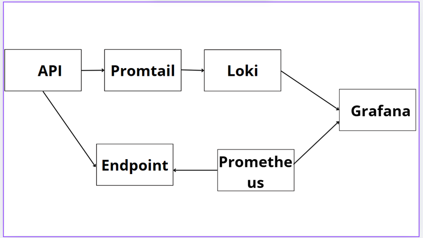
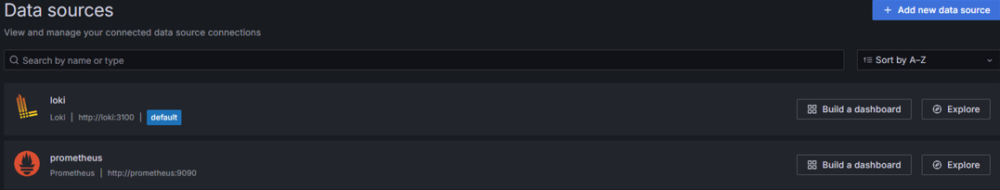
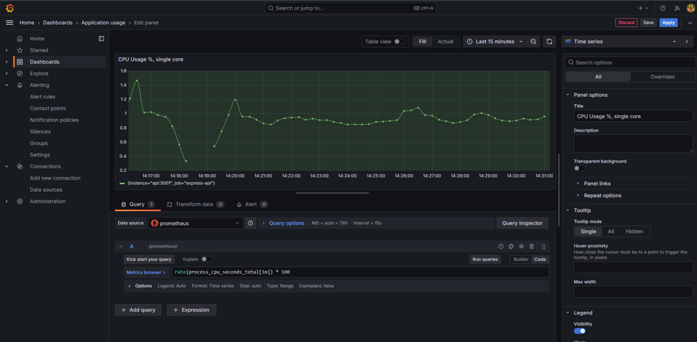

# 📊 Express.js API Monitoring & Observability Stack

A complete, Dockerized observability and monitoring stack tailored for Node.js (Express) APIs. This system periodically queries the API, collecting both metrics and logs, which allows for real-time tracking and alerting on system load, potential threats, HTTP request statistics, and application behavior.

The system is highly scalable and can be expanded by adding metrics from other APIs.

## 🚀 Tech Stack

* **Docker** & **Docker Compose**
* **Promtail (v2.9.0)**
* **Prometheus**
* **Loki (v2.9.0)**
* **Grafana (v11.1.0)**
* **Node.js & Express** (with `winston` and `prom-client`)

## 🏗️ System Architecture

*Note: This architecture was designed for use in a local environment running in Docker containers. If deployed to production, configuration files should be adjusted for security and modified communication.*

 

### Components:
* **API**: Generates logs and metrics using `winston` and `prom-client` libraries.
* **Promtail**: Collects logs from the Docker console and text files, adds labels, filters unnecessary info, and sends converted data to Loki.
* **Loki**: Indexes and stores log data used for creating dashboards.
* **Endpoint**: A specific `/metrics` route created for Prometheus to connect to.
* **Prometheus**: Queries the API at regular intervals via the endpoint to collect and store generated metrics.
* **Grafana**: Visualizes data retrieved from both Loki and Prometheus.

---

## 🛠️ Getting Started (Launch)

To run the monitoring service, enable all services in Docker containers and rebuild the project.

```bash
# 1. Build the API project
npm run build

# 2. Build the Docker image for the API without cache
docker compose build --no-cache api

# 3. Start all services in detached mode
docker compose up -d
```

---

## 💻 Application Setup (Node.js / Express)

### 1. Logging with Winston
The application uses `winston` to format logs. In Docker, logs are redirected to the console, where Promtail can retrieve them.

```typescript
import { createLogger, format, transports } from 'winston';
const { combine, timestamp, errors, json } = format;

// Define Logger
export const logger = createLogger({
  level: process.env.LOG_LEVEL || 'info',
  format: combine(timestamp(), errors({ stack: true }), json()),
  transports: [
    new transports.Console()
  ],
});

// Example Usage: Logging User Logins
export const logLogin = (userID: number, sessionId: string) => {
  logger.info({
    event: 'login',
    userID,
    sessionId,
    logInDate: new Date().toISOString(),
  });
};
```

### 2. Creating Prometheus Metrics
Metrics are exposed using the `prom-client` library. Default metrics (CPU, RAM, process duration) are collected automatically.

```typescript
import client from 'prom-client';
import { Application, Request, Response } from 'express';

// Collect default system metrics
client.collectDefaultMetrics();

// Custom Metric Example: Counter
const httpRequestCounter = new client.Counter({
  name: 'http_requests_total',
  help: 'Total number of HTTP requests',
  labelNames: ['method', 'route', 'status', 'userId'],
});

// Custom Metric Example: Gauge
const currentLoggedInUsers = new client.Gauge({
  name: 'current_logged_in_users',
  help: 'Current number of logged-in users'
});

export const incrementLoggedInUsers = (): void => { currentLoggedInUsers.inc(); }
export const decrementLoggedInUsers = (): void => { currentLoggedInUsers.dec(); }

// Expose the /metrics endpoint
export const exposeMetricsEndpoint = (app: Application): void => {
  app.get('/metrics', async (_req: Request, res: Response) => {
    res.set('Content-Type', client.register.contentType);
    res.end(await client.register.metrics());
  });
};
```

---

## ⚙️ Infrastructure Configuration Files

### 1. Docker Compose (`docker-compose.yml`)
Starts the database, API, and the entire observability stack, ensuring proper health checks and restart policies.

```yaml
version: '3.8'
services:
  mariadb:
    container_name: mariadb
    image: mariadb:11.4
    environment:
      MARIADB_ROOT_PASSWORD: "example_password"
      MARIADB_ROOT_HOST: "%"
      MARIADB_DATABASE: telemetry_db
    ports:
      - "3306:3306"
    volumes:
      - mariadb-data:/var/lib/mysql
    healthcheck:
      test: ["CMD", "mariadb-admin", "ping", "-h", "localhost", "-p$MARIADB_ROOT_PASSWORD"]
      interval: 5s
      retries: 10
    restart: unless-stopped

  api:
    build: .
    container_name: api
    ports:
      - "3001:3001"
    environment:
      - NODE_ENV=production
      - TZ=Europe/Madrid
    command: ["node", "/api/dist/server.js"]
    depends_on:
      mariadb:
        condition: service_healthy
    restart: unless-stopped

  loki:
    image: grafana/loki:2.9.0
    container_name: loki
    command: -config.file=/etc/loki/loki-config.yml
    volumes:
      - ./loki-config.yml:/etc/loki/loki-config.yml:ro
      - loki-data:/loki
    ports:
      - "3100:3100"
    restart: unless-stopped

  promtail:
    image: grafana/promtail:2.9.0
    container_name: promtail
    command: -config.file=/etc/promtail/config.yml
    volumes:
      - ./promtail-config.yml:/etc/promtail/config.yml:ro
      - /var/run/docker.sock:/var/run/docker.sock:ro
    depends_on:
      - loki
    restart: unless-stopped

  grafana:
    image: grafana/grafana:11.1.0
    container_name: grafana
    ports:
      - "3000:3000"
    environment:
      - GF_SMTP_ENABLED=true
      - GF_SMTP_HOST=smtp.gmail.com:587
    volumes:
      - grafana-data:/var/lib/grafana
    depends_on:
      - loki
    restart: unless-stopped

  prometheus:
    image: prom/prometheus
    container_name: prometheus
    ports:
      - "9090:9090"
    volumes:
      - ./prometheus.yml:/etc/prometheus/prometheus.yml:ro
      - prometheus-data:/prometheus
    restart: unless-stopped

volumes:
  mariadb-data:
  loki-data:
  grafana-data:
  prometheus-data:
```

### 2. Prometheus Config (`prometheus.yml`)
Queries the endpoint every 5 seconds to gather metrics.

```yaml
global:
  scrape_interval: 5s

scrape_configs:
  - job_name: 'express-api'
    static_configs:
      - targets: ['api:3001']
```

### 3. Promtail Config (`promtail-config.yml`)
Uses Docker Service Discovery via `docker.sock` to detect containers and extracts JSON logs.

```yaml
server:
  http_listen_port: 9080
  grpc_listen_port: 0

positions:
  filename: /tmp/positions.yaml

clients:
  - url: http://loki:3100/loki/api/v1/push

scrape_configs:
  - job_name: docker
    docker_sd_configs:
      - host: unix:///var/run/docker.sock
        refresh_interval: 5s
    relabel_configs:
      - source_labels: ['__meta_docker_container_name']
        regex: '/(.*)'
        target_label: container
      - source_labels: ['__meta_docker_container_label_com_docker_compose_service']
        target_label: service
      - source_labels: ['__meta_docker_container_log_stream']
        target_label: stream
    pipeline_stages:
      - regex:
          expression: '^(?P<prefix_ts>\d{4}-\d{2}-\d{2} \d{2}:\d{2}:\d{2}) (?P<payload>\{.*\))?$|^(?P<payload_only>\{.*\})$'
      - template:
          source: payload
          template: '{{ if .Value }}{{ .Value }}{{ else }}{{ .payload_only }}{{ end }}'
      - json:
          source: payload
          expressions:
            level: level
            timestamp: timestamp
            message: message
      - json:
          source: message
          expressions:
            event: event
            rid: rid
            method: method
            url: url
            ip: ip
            statusCode: statusCode
            durationMs: durationMs
            origin: headers.origin
      - labels:
          level:
          event:
          url:
          method:
          statusCode:
          origin:
      - timestamp:
          source: timestamp
          format: RFC3339Nano
      - match:
          selector: '{event!="http_request"}'
          stages:
            - drop:
                expression: '.*'
```

### 4. Loki Config (`loki-config.yml`)

```yaml
auth_enabled: false

server:
  http_listen_port: 3100

common:
  path_prefix: /loki

storage:
  filesystem:
    chunks_directory: /loki/chunks
    rules_directory: /loki/rules

replication_factor: 1

ring:
  instance_addr: 127.0.0.1
  kvstore:
    store: inmemory

schema_config:
  configs:
    - from: 2020-10-24
      store: boltdb-shipper
      object_store: filesystem
      schema: v11
      index:
        prefix: index_
        period: 24h

ruler:
  storage:
    type: local
    local:
      directory: /loki/rules
```

---

## 📈 Using Grafana

During the first start, you need to create an admin account. Grafana is available at `http://localhost:3000`.

### Data Sources
To create a connection with Prometheus and Loki, navigate to the "Add new connection" tab and select the appropriate data source. You will need to provide the addresses for Loki (`http://loki:3100`) and Prometheus (`http://prometheus:9090`).

 

### Dashboards & Visualizations
The dashboards section is where panels with visualizations are created. To retrieve data, queries are built in **PromQL** (for Prometheus metrics) or **LogQL** (for Loki logs).

 
